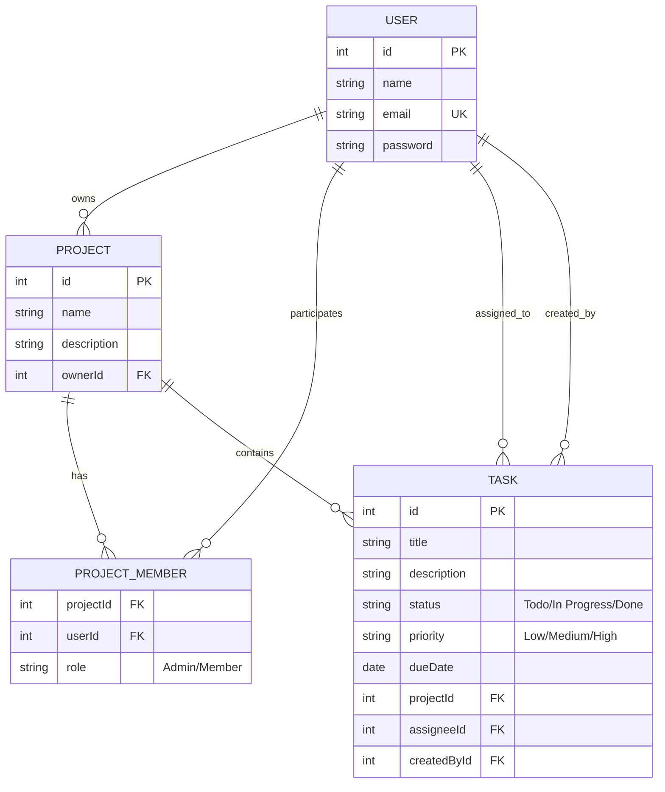

# 🚀 Team Task Manager

[](https://opensource.org/licenses/MIT)
[](https://nodejs.org/)
[](https://expressjs.com/)
[](https://sequelize.org/)
[](https://railway.app/)

A professional full-stack web application designed for teams to orchestrate projects, manage tasks, and track real-time progress with a sophisticated Role-Based Access Control (RBAC) system.

---

## ✨ Key Features

- 🔐 **Secure Authentication** — Advanced Signup & Login flows powered by **JWT** and **bcrypt** password hashing.
- 🏗️ **Project Orchestration** — Create projects, manage team member lists, and define high-level workspace goals.
- 📋 **Dynamic Task Management** — Full CRUD for tasks with status tracking (*Todo / In Progress / Done*), priority levels (*Low / Medium / High*), and due dates.
- 📊 **Insightful Dashboard** — Real-time metrics including total tasks, personal workload, status breakdown, and overdue tracking.
- 🛡️ **Granular RBAC** — Precise permission handling for Owners, Admins, and Members.
- 🔌 **RESTful Architecture** — Clean JSON API with robust server-side validations and relational integrity.

---

## 🛡️ Role-Based Access Control (RBAC)

| Feature | Owner | Admin | Member |
| :--- | :---: | :---: | :---: |
| **Delete Project** | ✅ | ❌ | ❌ |
| **Edit Project Details** | ✅ | ✅ | ❌ |
| **Manage Members** | ✅ | ✅ | ❌ |
| **Reassign Tasks** | ✅ | ✅ | ❌ |
| **Edit Any Task** | ✅ | ✅ | ❌ |
| **View Project** | ✅ | ✅ | ✅ |
| **Create Tasks** | ✅ | ✅ | ✅ |
| **Edit Own/Assigned Tasks**| ✅ | ✅ | ✅ |

---

## 🛠️ Tech Stack

### Backend & Database
- **Runtime**: Node.js (v18+)
- **Framework**: Express.js
- **ORM**: Sequelize (SQL abstraction)
- **Database**: 
  - **Production**: PostgreSQL (Managed on Railway)
  - **Development**: SQLite (Zero-config, local storage)
- **Security**: JWT (JSON Web Tokens), bcryptjs

### Frontend
- **Structure**: Semantic HTML5
- **Styling**: Vanilla CSS3 (Responsive Design)
- **Logic**: Vanilla JavaScript (Modern ES6+)
- **Assets**: Served statically via Express `/public`

---

## 📊 Database Schema



---

## 📂 Project Structure

```text
.
├── server.js                # Application entrypoint
├── config/db.js             # Sequelize & database configuration
├── models/                  # Sequelize models (User, Project, Task, etc.)
├── middleware/              # Auth, RBAC, and Validation logic
├── routes/                  # API Route definitions
├── utils/serializers.js     # Data shaping helpers
├── public/                  # Frontend assets (HTML, CSS, JS)
├── data/                    # Local SQLite storage (Gitignored)
├── package.json             # Dependencies & scripts
└── railway.json             # Deployment configuration
```

---

## ⚙️ Local Development

### Prerequisites
- **Node.js 18+** installed on your system.
- No database installation required (defaults to SQLite for local dev).

### Setup Instructions

1. **Clone & Install**:
   ```bash
   git clone https://github.com/your-username/team-task-manager
   cd team-task-manager
   npm install
   ```

2. **Environment Configuration**:
   Copy `.env.example` to `.env` and configure your secrets:
   ```bash
   cp .env.example .env
   ```
   Edit `.env`:
   - `JWT_SECRET`: A long random string.
   - `DATABASE_URL`: Leave empty for SQLite, or provide a Postgres URI.

3. **Launch**:
   ```bash
   npm run dev
   ```
   The application will be live at `http://localhost:5000`. Database tables are automatically synchronized on first run.

---

## 🔌 REST API Reference

All endpoints (except Auth) require a `Bearer <token>` in the `Authorization` header.

### 🔐 Authentication
| Method | Path | Description |
| :--- | :--- | :--- |
| `POST` | `/api/auth/signup` | Register a new account |
| `POST` | `/api/auth/login` | Login and receive JWT |
| `GET` | `/api/auth/me` | Retrieve current user profile |

### 📁 Projects
| Method | Path | Description |
| :--- | :--- | :--- |
| `GET` | `/api/projects` | List projects I'm a member of |
| `POST` | `/api/projects` | Create a new project |
| `GET` | `/api/projects/:id` | Get project details & tasks |
| `DELETE` | `/api/projects/:id` | Delete project (Owner only) |
| `POST` | `/api/projects/:id/members` | Add member by email (Admin) |

### 📋 Tasks
| Method | Path | Description |
| :--- | :--- | :--- |
| `GET` | `/api/tasks` | Filter tasks (projectId, status, etc.) |
| `POST` | `/api/tasks` | Create task within a project |
| `PUT` | `/api/tasks/:id` | Update task details/status |
| `DELETE` | `/api/tasks/:id` | Remove task (Admin/Creator only) |

---

## 🚀 Deployment (Railway)

1. Connect your GitHub repository to [Railway.app](https://railway.app).
2. Add a **PostgreSQL** service to your project.
3. Railway will automatically inject the `DATABASE_URL`. Ensure you also set:
   - `JWT_SECRET`: Secure random string.
   - `NODE_ENV`: `production`
4. Deploy! Sequelize will handle the database migrations automatically.

---

## 📄 License

Distributed under the **MIT License**. See `LICENSE` for more information.

---

**Team Task Manager** — *Empowering teams to achieve more.*

